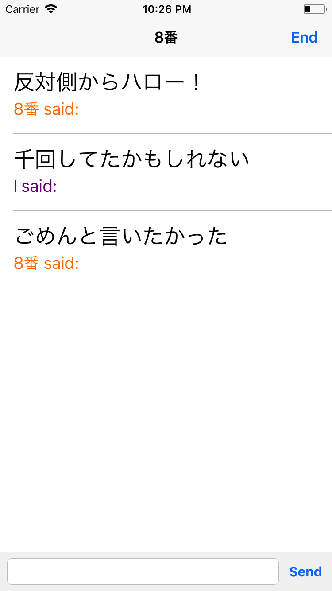
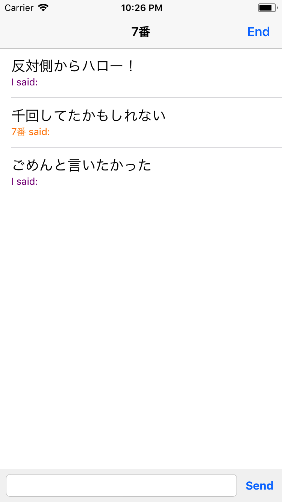
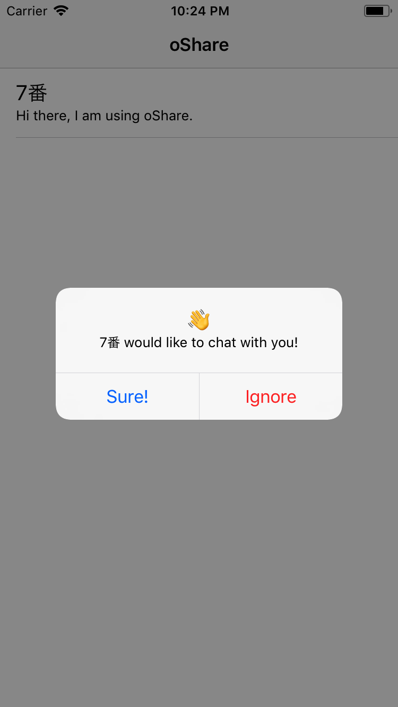
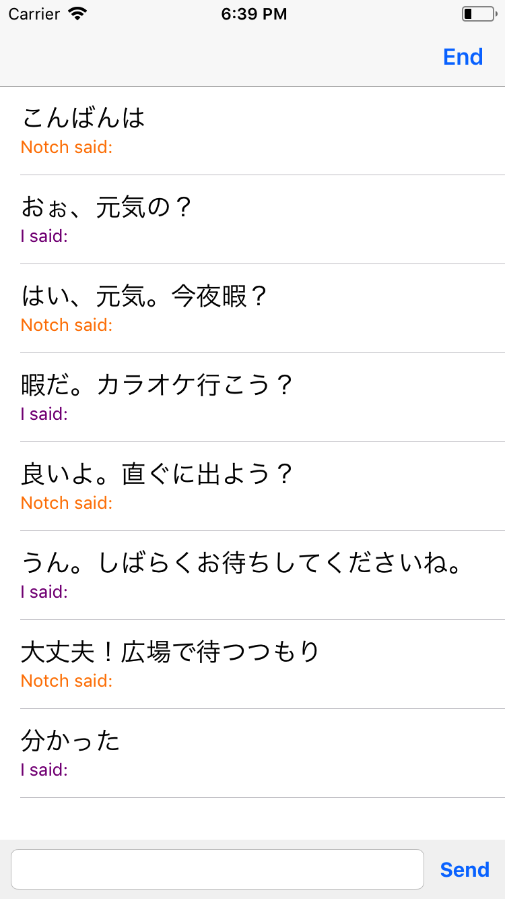

# oShare
#### A sample chat app for iOS using the MultipeerConnectivity framework.

# About

This app was developed using Apple's own MultipeerConnectivity framework, and is intended solely as a demonstration product. This is a framework I was interested in learning, nothing more.

I opted to take advantage of Apple's dynamic font system in both the peer browser and chat interface.

You may take this source code and use it freely, as per the MIT License. All I ask for is recognition, any valid criticism, and improvements to the codebase in the form of PRs if you feel them necessary.

# Images

Hello from the other side! 

Hey, I would like to chat with you! 

Let's go to Karaoke. 

# Disclaimers

As this is my first foray into such a framework, I make no guarantees of this code being suitable for a production app. I did however perform extensive testing across mutliple instances of Simulator, and across various iPhone and iPad devices I had lying around.
